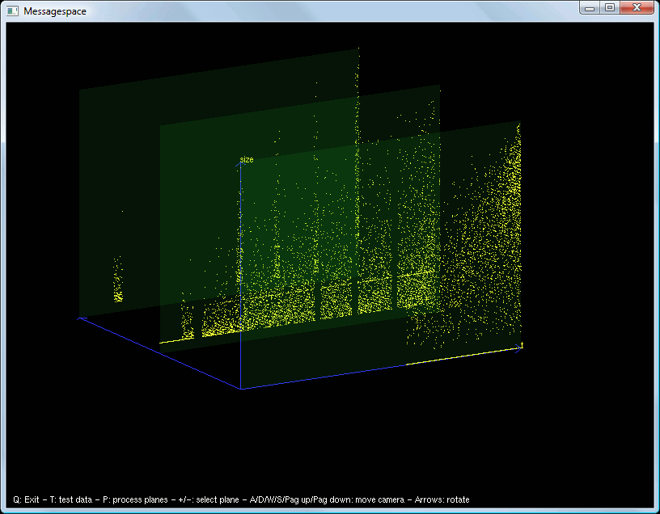

mpimessagespace
===============

This tool shows the "send" messages of a set of MPI processes in a 3D spaces. It draws each "send" as a point. The x-axis is the time, the y-axis is the message's size, and the processes are on z-axis. All points related to a single process are in a plane parallel to the x-y one.

Keyboard commands
-----------------

    Q: quit;
    Arrows: rotate the axis;
    A/D/W/S/Pag up/Pag down: move the camera;
    P: show/hide process planes;
    +/-: when showing process planes, choose the highlighted one;
    T: fill the graph with random test data.

Screenshots
-----------

